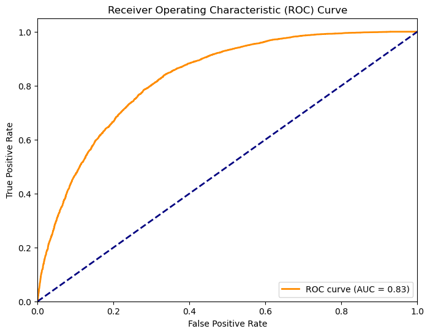
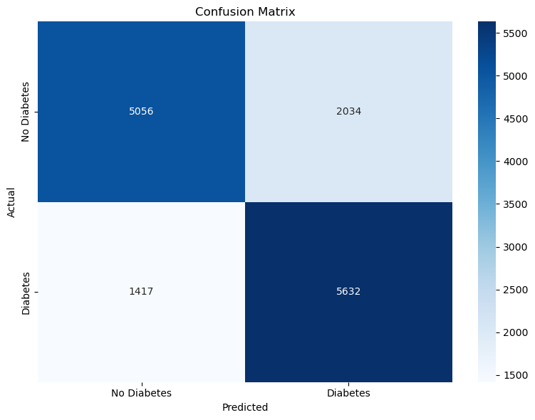

# Diabetes-predictor-ML

Presentation Link: https://docs.google.com/presentation/d/1xWjblsn67Rd9C_NS568wlAKU4kz-Vnx8hmAK-SH7rYw/edit?usp=sharing

## **Overview:**

Diabetes is a chronic disease that affects how your body turns food into energy. In america over 34 million people have diabetes, and 90-95% of them have type 2 diabetes. In this analysis we will be using a dataset from the Behavioral Risk Factor Surveillance System (BRFSS) in conducted 2015 with over 70,000 participants and 18 different features to predict whether a person has diabetes.

In this project we examined 8 different models to predict whether a person has diabetes. We started with a simple logistic regression model, and then moved on to more complex models such as random forests and gradient boosting. After tuning the hyperparameters of the random forest and gradient boosting models, we found that the gradient boosting model performed the best.

## **Data:**

The dataset contains 70,000 observations and 18 features. The features are as follows:
**AgeMean:** The average age of the participant.

**Gender:** The gender of the participant.

**HighCholesterol:** Whether the participant has high cholesterol.

**CholesterolCheck:** Whether the participant has had their cholesterol checked in the past year.

**BodyMassIndex:** The body mass index of the participant.

**SmokerStatus:** Whether the participant is a smoker.

**HeartDiseaseHistory:** Whether the participant has had a heart disease in the past.

**PhysicalActivity:** Whether the participant has had physical activity in the past month.

**DailyFruitIntake:** Does the participant eat fruit daily.

**DailyVegetableIntake:** Does the participant eat vegetables daily.

**HeavyAlcoholConsumption:** Whether the participant has had heavy alcohol consumption in the past month.

**GeneralHealth:** A self reported 1-5 of the general health of the participant.

**PoorMentalHealthDays:** The number of days the participant has poor mental health in the past month.

**PoorPhysicalHealthDays:** The number of days the participant has poor physical health in the past month.

**DifficultyWalking:** Whether the participant has difficulty walking.

**StrokeHistory:** Whether the participant has had a stroke in the past.

**HighBloodPressure:** Whether the participant has high blood pressure.

**DiabetesDiagnosis:** Whether the participant has been diagnosed with diabetes.

## **Model Selection:**

We looked at 8 different models to predict whether a person has diabetes. SVM, Log Regression, Decision Tree, KNN, Random Forest, Extra Trees, Gradient Booster, AdaBoost.

Our inital results were:
| Model | Training Accuracy | Test Accuracy |
|-------|------------------|---------------|
| Logistic Regression | 0.747 | 0.746 |
| SVM | 0.747 | 0.745 |
| Decision Tree | 0.972 | 0.658 |
| K-Nearest Neighbors | 0.798 | 0.716 |
| Random Forest | 0.972 | 0.728 |
| Extremely Random Trees | 0.972 | 0.712 |
| **Gradient Boosting** | **0.754** | **0.753** |
| AdaBoost | 0.754 | 0.753 |

## **Model Tuning:**

The most important features in our dataset for predicting diabetes are:

| Feature | Importance |
|---------|------------|
| HighBloodPressure | 0.344331 |
| GeneralHealth | 0.284835 |
| BodyMassIndex | 0.120282 |
| AgeMean | 0.105857 |
| HighCholesterol | 0.067682 |
| DifficultyWalking | 0.016771 |
| HeartDiseaseHistory | 0.016018 |
| HeavyAlcoholConsumption | 0.011598 |
| CholesterolCheck | 0.009550 |
| Gender | 0.007637 |

## **Results:**

In the end, we were able to achieve an accuracy of 75% on the test set, precision of 70%, and an AUC of 0.832.

The classification report below shows the detailed performance metrics for our best performing model:

| Class | Precision | Recall | F1-Score | Support |
|-------|-----------|--------|----------|---------|
| No Diabetes (0) | 0.83 | 0.63 | 0.71 | 7,090 |
| Diabetes (1) | 0.70 | 0.87 | 0.77 | 7,049 |

Overall Metrics:
- Accuracy: 75% (10,604/14,139 cases)
- Macro Average: 0.76 precision, 0.75 recall, 0.74 F1-score
- Weighted Average: 0.76 precision, 0.75 recall, 0.74 F1-score

This shows our model is particularly good at identifying diabetes cases (87% recall) while maintaining reasonable precision (70%). For non-diabetes cases, the model has high precision (83%) but lower recall (63%).

The confusion matrix above provides a detailed breakdown of our model's predictions. 

Out of the 14,139 total cases, our model correctly identified 4,466 people without diabetes (true negatives) and 6,138 people with diabetes (true positives). However, there were 2,624 false positives (people incorrectly classified as having diabetes) and 911 false negatives (people with diabetes who were missed by the model). This is inline with our model's tedency to be more sensitive to diabetes cases (with our higher recall) at the expense of higher false positivies. The higher number of false positives compared to false negatives aligns with our preference to err on the side of caution, as missing a diabetes diagnosis (false negative) could have more serious consequences than a false positive which would likely be caught in subsequent medical testing.
